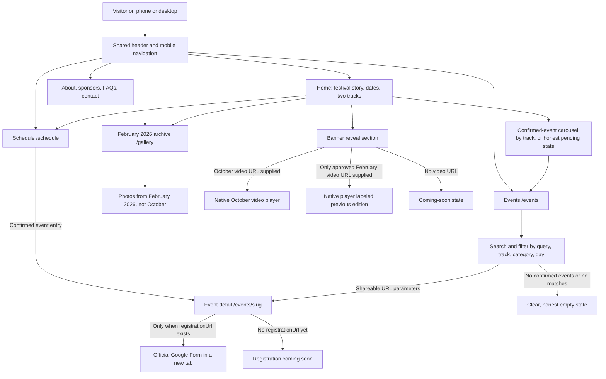
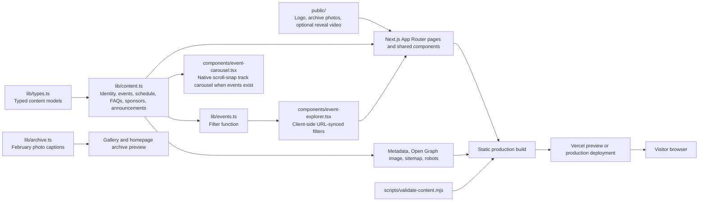

# Techriti website architecture

This is the current architecture of the local Next.js site, not a diagram of features that have not been built. Techriti 2026 is planned for 16–17 October at MGIT, Hyderabad. The event lineup, room assignments, sponsors, Instagram URL, and reveal video are not yet confirmed in the repository. The newer visual and UX brief is captured in `docs/design-direction.md`.

## Visitor flow

The site does not collect registrations, payments, or accounts. An event's `Register Now` link appears only when its own `registrationUrl` is supplied, and opens the external form with `noopener noreferrer`.

## Content and rendering flow

`app/layout.tsx` supplies the shared header, footer, fonts, metadata base, and skip link. Most pages are statically rendered. The event explorer is a client component because its search and filters synchronize with URL parameters such as `/events?q=robotics&division=Technical&category=competition&day=2`. Event detail pages are generated from confirmed slugs in `events` and use `notFound()` for an unknown slug.

## Route map

| Route | Purpose | Main source |
| --- | --- | --- |
| `/` | Halloween hero, immediate event discovery, story, reveal, dates, archive preview, FAQs | `app/home-immersive.tsx`, `lib/content.ts`, `lib/archive.ts` |
| `/events` | Searchable and filterable lineup | `components/event-explorer.tsx`, `lib/events.ts` |
| `/events/[slug]` | Rules, eligibility, time, room, and external registration | `lib/content.ts` |
| `/schedule` | Day 1 and day 2 schedule | `lib/content.ts` |
| `/gallery` | Clearly labeled February 2026 photo archive | `lib/archive.ts`, `public/archive/` |
| `/about`, `/sponsors`, `/faq`, `/contact` | Festival context and practical information | `lib/content.ts` and page content |
| `/icon.png`, `/opengraph-image`, `/sitemap.xml`, `/robots.txt` | Browser icon and discoverability | App Router metadata files |

## Updating the site

1. Organizers confirm an event's name, description, track, day, time, MGIT room, rules, and Google Form.
2. A developer adds a typed `Event` entry to `lib/content.ts`; the stable slug creates its detail route and the listing becomes searchable.
3. A developer adds related `ScheduleItem` entries after times and rooms are confirmed. The schedule can then link back to the event page via `eventSlug`.
4. A developer updates `siteConfig` for official contact, Instagram, and banner reveal video details when supplied. Sponsors and announcements also live in `lib/content.ts`.
5. The Vercel build runs `npm run validate:content && npm run build` via `vercel.json`. Review the preview deployment before production promotion.

The current validation script rejects known bracketed placeholders and non-Google `registrationUrl` values in production. It does **not** require the event, schedule, or sponsor arrays to be non-empty, or verify every real-world detail. Those remain editorial launch checks.

## Design constraints

The restarted 8 October redesign uses a near-black/ember/plum system with the existing transparent symbolic mark and Geist type. The active homepage is `app/home-immersive.tsx`: an editorial-split Halloween hero keeps the event route in the first mobile screen, followed immediately by the two tracks or a confirmed-event swipe carousel. Search and shareable track/category/day filtering remain on `/events`. The shared page hero, header, footer, event cards and filters, event detail, schedule, About, Gallery, FAQs, Contact, and Partners pages now follow the same dark system. Selected MGIT photos remain clearly labeled as February 2026 archive material; the Gallery shows a varied editorial grid with larger image links. The October banner film is never simulated; an older approved film must be labeled as an archive. A real per-event Google Form enables the safe external registration CTA, including the sticky mobile button. Motion remains restrained and respects reduced motion. This design is local, built successfully, and still needs browser/device accessibility review and organizer sign-off before launch.
