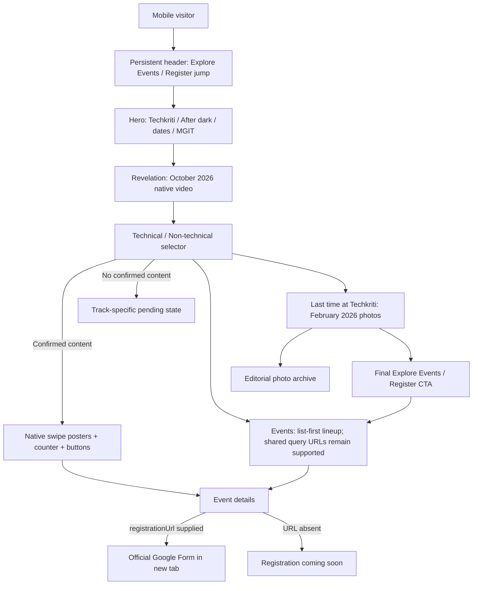
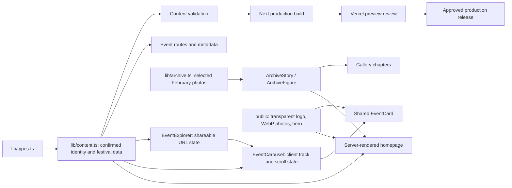

# Techkriti website architecture

The existing Next.js App Router, TypeScript, and Tailwind application targets Vercel. This document describes the local implementation of the latest 8 October 2026 brief. Confirmed festival dates are 16–17 October 2026 at MGIT. October event details and registration forms remain unconfirmed.

## Homepage and visitor flow

The latest brief places the revelation before events in the scroll narrative. Events remain reachable immediately through the hero and header. No homepage About, expectation-card grid, FAQ block, or extra date section remains. Their useful supporting routes are preserved.

## Content and rendering

`app/layout.tsx` supplies the font, shared header/footer, skip link, and metadata base. `app/page.tsx` imports `app/home-immersive.tsx`. Historical alternative homepage files are inactive and have not been deleted.

## Routes

| Route | Purpose |
| --- | --- |
| `/` | Hero → October reveal video → discovery → February photo story → final CTA |
| `/events` | List-first confirmed lineup; optional shared query parameters can narrow a view |
| `/events/[slug]` | Essentials, description, rules, supplied prizes and external form |
| `/schedule` | Day-based confirmed schedule |
| `/gallery` | All 19 selected February photos, arranged in three editorial chapters |
| `/about`, `/sponsors`, `/faq`, `/contact` | Supporting context and practical information |
| `/icon.png`, `/opengraph-image`, `/sitemap.xml`, `/robots.txt` | Browser icon and discovery metadata |

Unknown event slugs return 404. Shared query URLs remain supported for organizer links, for example `/events?q=robotics&division=Technical&category=competition&day=2`; the public page intentionally keeps the visual surface list-first.

## Component boundaries

- **BannerReveal:** static server-rendered native MP4 player with controls, inline playback, and metadata preload. It does not autoplay and has no previous-edition fallback.
- **EventCarousel:** a small client component. Track switching resets its keyed scroll region. Native scroll-snap handles touch; arrows, keyboard arrows/Home/End, a live counter, and a resize observer keep navigation usable. A trailing spacer permits final-card alignment on wide screens. Empty tracks show a status, never fake cards or controls.
- **EventCard:** shared by the listing and carousel. Optional `image: { src, alt }` supports local approved artwork; otherwise the title receives a consistent poster treatment. The carousel variant offers details; listing registration appears only if supplied.
- **EventDetailView:** essentials appear before longer content on mobile; the desktop sidebar remains sticky. More than four rules use a native disclosure. A supplied Google Form enables the mobile fixed CTA with safe-area/footer clearance.
- **ArchiveStory / ArchiveFigure:** optimized, lazy-loaded images with reserved aspect ratios, descriptive alt text, captions, and accessible larger-image links. Photography retains its original color.
- **SiteHeader:** Events stays visible on mobile. Escape closes the menu and restores button focus; the menu scrolls within small-height viewports.
- **SiteFooter:** compact supporting links and festival identity.

## Updating content

1. Add only confirmed `Event` entries to `lib/content.ts`. Slugs generate detail pages automatically.
2. Put optimized event artwork in `public/events/` and supply `image.src` / `image.alt` if available. No UI rewrite is needed.
3. Add real `registrationUrl` values from Google Forms; absent URLs keep registration hidden.
4. Add related schedule items after times and rooms are confirmed.
5. Update contact/social/sponsor data when approved. Replace `siteConfig.bannerVideoUrl` only when the organizers supply a newer approved film.
6. Run content validation, lint, type checking, build, and browser tests. Review a Vercel preview before production.

The existing content validator detects known placeholder tokens and invalid Google Form hosts in production. It does not certify real-world accuracy or require non-empty event/schedule arrays.

## Verification architecture

`npm run test:ui` uses Playwright with installed Chrome and a local production server on port 3100; run `npm run build` first. It covers specified viewport widths, first-screen event access, route/query behavior, native touch, keyboard controls, missing forms, and axe accessibility checks.

Synthetic event data lives only in `tests/fixtures.ts`. A browser-intercepted test document bundles the real components with simple Next Link/Image adapters, allowing populated-state checks without adding fake events or a test route to the production app. The production pages themselves are tested separately. Screenshots and traces are ignored under `test-results/`.

Local verification is separate from physical-device testing, organizer sign-off, and deployment. This pass does not publish to Vercel or push to GitHub.
